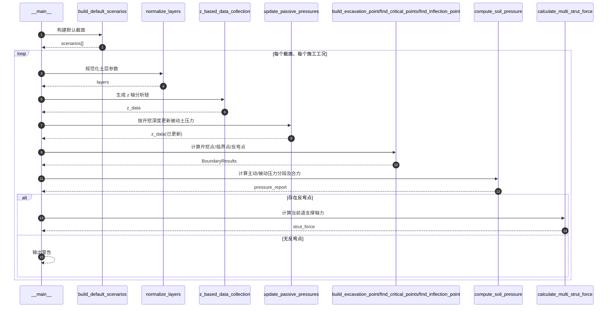
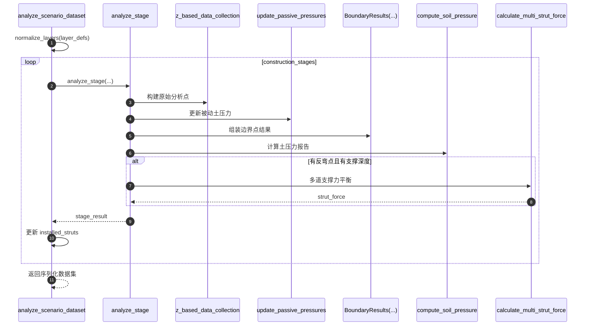

# calc2.py 通信图

```mermaid
sequenceDiagram
    autonumber
    participant Main as __main__
    participant Scenario as build_default_scenarios
    participant Normalize as normalize_layers
    participant ZChain as z_based_data_collection
    participant Passive as update_passive_pressures
    participant Bound as build_excavation_point/find_critical_points/find_inflection_point
    participant Pressure as compute_soil_pressure
    participant Strut as calculate_multi_strut_force

    Main->>Scenario: 构建默认截面
    Scenario-->>Main: scenarios[]
    loop 每个截面、每个施工工况
        Main->>Normalize: 规范化土层参数
        Normalize-->>Main: layers
        Main->>ZChain: 生成 z 轴分析链
        ZChain-->>Main: z_data
        Main->>Passive: 按开挖深度更新被动土压力
        Passive-->>Main: z_data(已更新)
        Main->>Bound: 计算开挖点/临界点/反弯点
        Bound-->>Main: BoundaryResults
        Main->>Pressure: 计算主动/被动压力分段及合力
        Pressure-->>Main: pressure_report
        alt 存在反弯点
            Main->>Strut: 计算当前道支撑轴力
            Strut-->>Main: strut_force
        else 无反弯点
            Main-->>Main: 输出警告
        end
    end
```

```mermaid
sequenceDiagram
    autonumber
    participant Dataset as analyze_scenario_dataset
    participant Stage as analyze_stage
    participant ZChain as z_based_data_collection
    participant Passive as update_passive_pressures
    participant Bound as BoundaryResults(...)
    participant Pressure as compute_soil_pressure
    participant Strut as calculate_multi_strut_force

    Dataset->>Dataset: normalize_layers(layer_defs)
    loop construction_stages
        Dataset->>Stage: analyze_stage(...)
        Stage->>ZChain: 构建原始分析点
        Stage->>Passive: 更新被动土压力
        Stage->>Bound: 组装边界点结果
        Stage->>Pressure: 计算土压力报告
        alt 有反弯点且有支撑深度
            Stage->>Strut: 多道支撑力平衡
            Strut-->>Stage: strut_force
        end
        Stage-->>Dataset: stage_result
        Dataset->>Dataset: 更新 installed_struts
    end
    Dataset-->>Dataset: 返回序列化数据集
```
