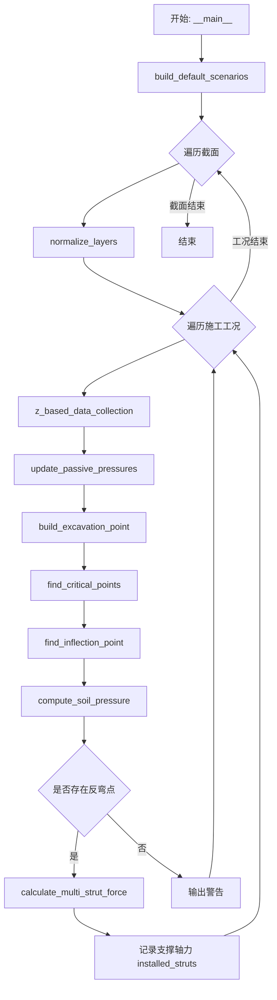
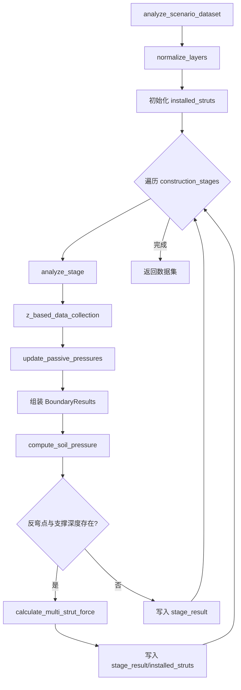

# calc2.py 逻辑图

```mermaid
flowchart TD
    A[开始: __main__] --> B[build_default_scenarios]
    B --> C{遍历截面}
    C --> D[normalize_layers]
    D --> E{遍历施工工况}
    E --> F[z_based_data_collection]
    F --> G[update_passive_pressures]
    G --> H[build_excavation_point]
    H --> I[find_critical_points]
    I --> J[find_inflection_point]
    J --> K[compute_soil_pressure]
    K --> L{是否存在反弯点}
    L -- 是 --> M[calculate_multi_strut_force]
    M --> N[记录支撑轴力 installed_struts]
    L -- 否 --> O[输出警告]
    N --> E
    O --> E
    E -->|工况结束| C
    C -->|截面结束| P[结束]
```

```mermaid
flowchart TD
    A1[analyze_scenario_dataset] --> B1[normalize_layers]
    B1 --> C1[初始化 installed_struts]
    C1 --> D1{遍历 construction_stages}
    D1 --> E1[analyze_stage]
    E1 --> F1[z_based_data_collection]
    F1 --> G1[update_passive_pressures]
    G1 --> H1[组装 BoundaryResults]
    H1 --> I1[compute_soil_pressure]
    I1 --> J1{反弯点与支撑深度存在?}
    J1 -- 是 --> K1[calculate_multi_strut_force]
    K1 --> L1[写入 stage_result/installed_struts]
    J1 -- 否 --> M1[写入 stage_result]
    L1 --> D1
    M1 --> D1
    D1 -->|完成| N1[返回数据集]
```
